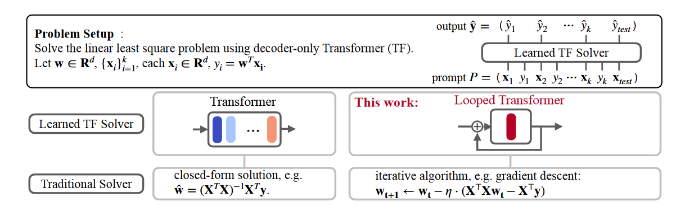
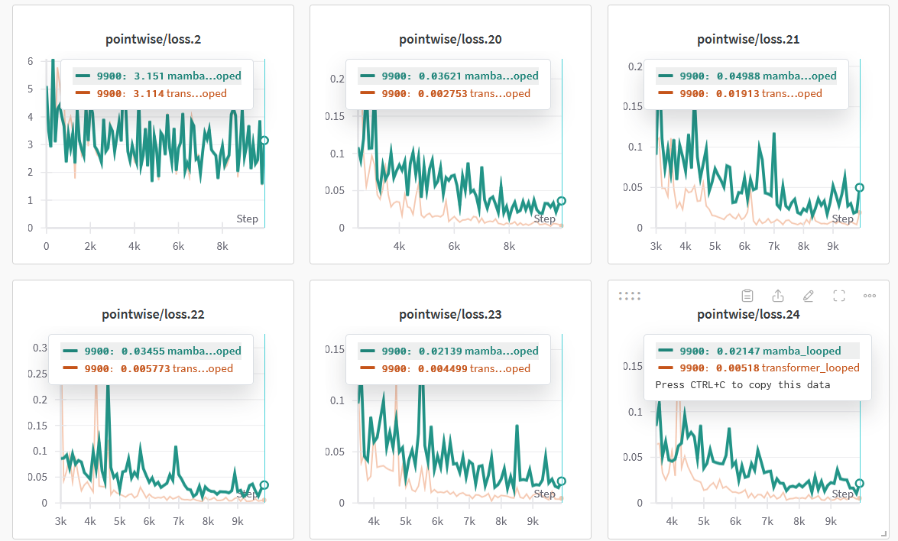
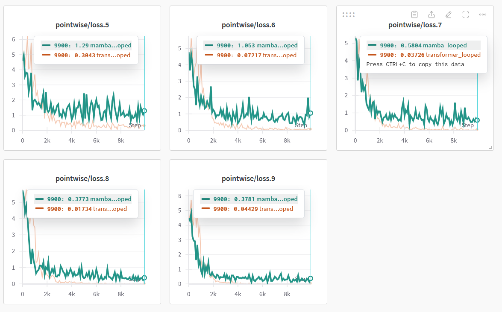
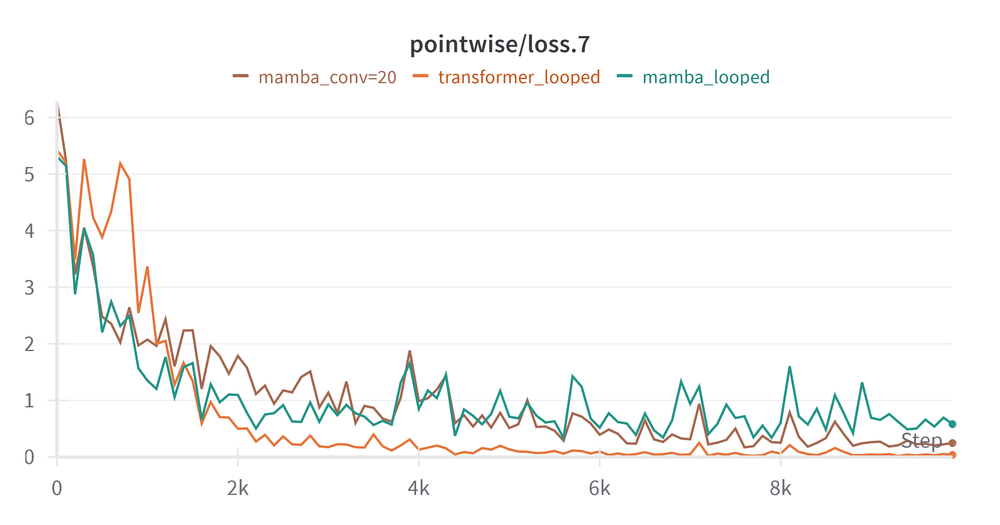
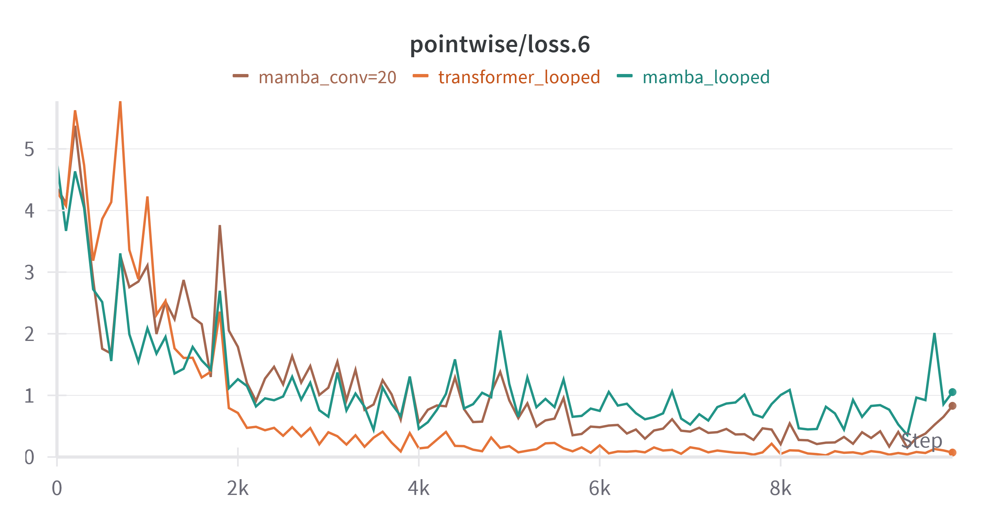
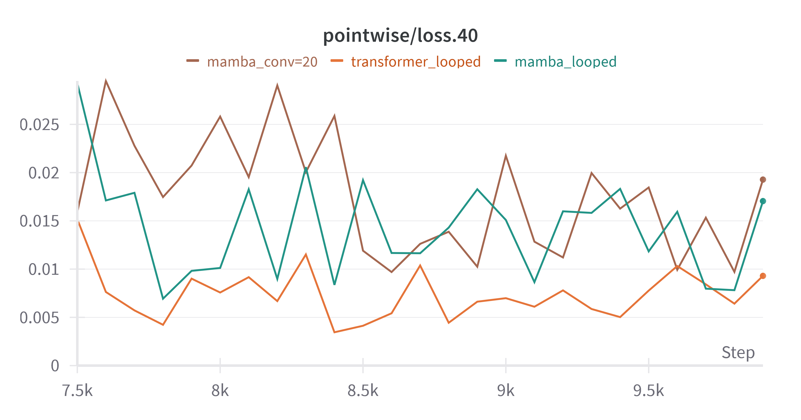
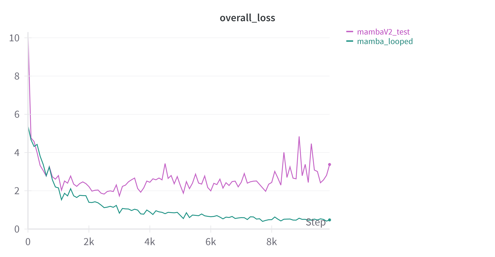
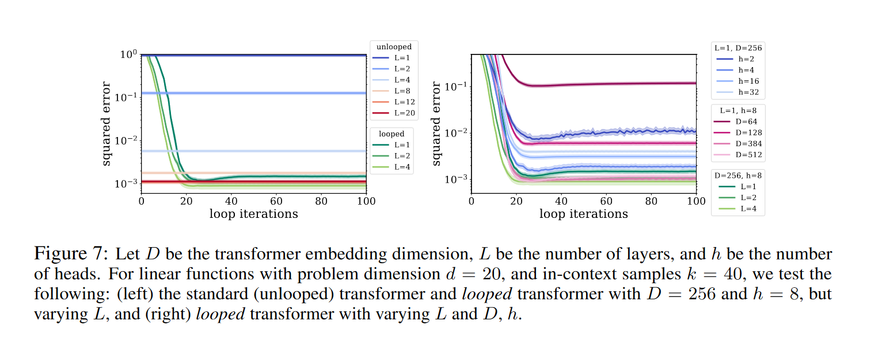
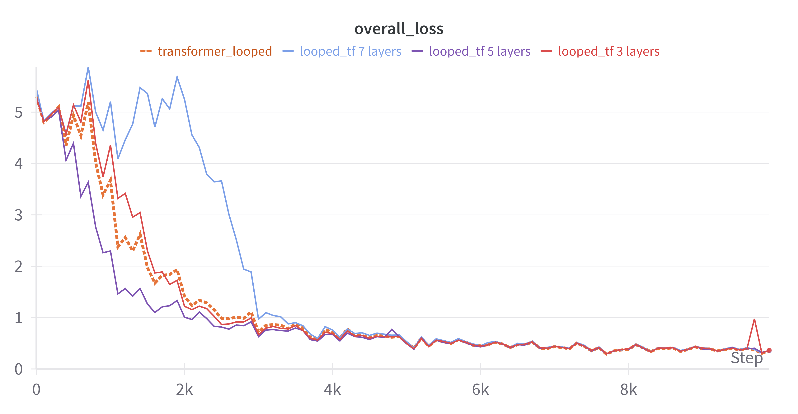
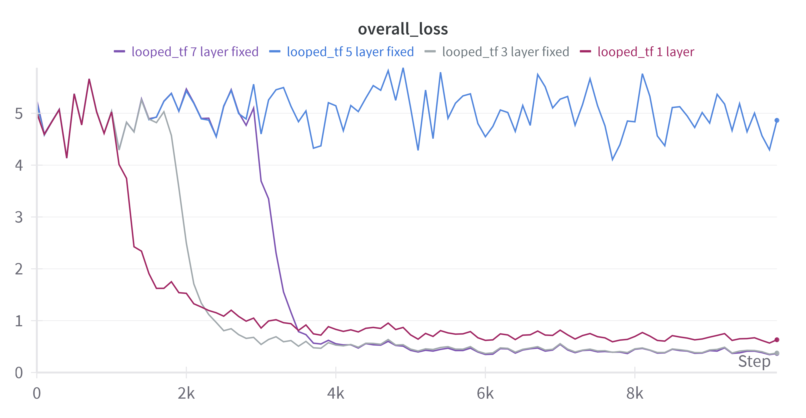

# Отчет по исследованию Looped Transformers

## 1. Введение
В ходе выполнения задания Я работал со статьей [Looped Transformers are better at learning learning algorithms](https://arxiv.org/abs/2311.12424v3), в рамках которой рассматривался вариант решения задачи in-context learning'а - решение задачи линейной регрессии. 
**Постановка проблемы:**
* Имеется набор входных данных $(x_1, y_1, x_2, y_2, \dots, x_k, y_k, x_{test})$, где $x_i \in \mathbb{R}^n$ - входные данные для задачи линейной регресси размерности n, $y_i \in \mathbb{R}$ - скаляр ответ линейной регрессии. 
* Задача модели предсказать вектор весов коеффициентов линейной регресси $w_i \in \mathbb{R}^n$. (Так как $Xw = y$, то это тоже самое, что предсказывать $y_i$).
* Обджектив в таком сетапе выглядит так - $\min_w \|Xw - y\|^2_2$ . Минимизируем MSE для заданного контекста $\rightarrow$ минимируем ошибку предсказания $y_{test}$, который нам неизвестен. 
**Основная идея работы:**
Один из вариантов решения задачи линейной регрессии - итеративно решать задачу с помощью градиентного спуска,  таким образом постепенно уменьшая ошибку.  
Для адаптации к подобному способу решения задачи, адаптировали архитектуру Looped Transformer. В ней инпут несколько раз проходит через  модель, постепенно уменьшая ошибку вычисления.

## 2. Методология
**В ходе работы я эксперементировал со следующими частями архитектуры модели и процесса обучения:**
1) В статье описывается метод input injection, который заключается в следующем: Для каждой итерации Looped Transformer на вход дополнительно с состоянием после предыдущей итерации подается дополнительно input вектор.  В ходе работы я исследовал, как варьирование количества информации из инпута будет влиять на схождение модели.
2) Я исследовал, как количество блоков трансформера, которые включает в себя один цикл Looped Transformer будет влиять на скорость схождения обучения. 
3) Я исследовал, как изменится процесс обучения, если трансформерный блок заменить на SSM

 **Сетап обучения, использовавшийся в процессе экспериментов:**
 Для обучения я использовал сетап sheduled training'a, который был описан в статье. В таком сетапе задача постепенно изменяется в процессе обучения, для лучшего схождения. Я использовал следующие параметры:
 ```yaml
 training:
    batch_size: 64
    task_name: linear_regression
    learning_rate: 0.0001
    train_steps: 10000
    save_every_steps: 1000
    keep_every_steps: 100000
    curriculum:
        dims:
            start: 5
            end: 5
            inc: 1
            interval: 5000
        points:
            start: 11
            end: 41
            inc: 2
            interval: 500
        loops:
            start: 20
            end: 350
            inc: 2
            interval: 500
    n_loop_window: 20
```
* Обучение включает в себя 10000 шагов
* Размерность входных данных для регрессии ($n$, где $x \in \mathbb{R}^n$) фиксирована в процессе обучения $n=5$
* Количество in-context примеров для обучения растет в процессе обучения. Изначально модель получает на вход 11 примеров. Каждые 500 итераций количество примеров растет на 2. Макимальное количество примеров, которые модель будет видеть в процесс обучения - 41
* Количество итераций Looped Transformer'a изначально равно 20. Каждые 500 итераций вместе с увеличением количества семплов конекста, количество итераций также увеличивается на 2. Таким образом в конце обучения количество итераций - 58. 
* В процессе обучения в каждого шага градиент вычисляется только для 20 шагов, для того, чтобы ускорить обучение и стабилизировать градиент. 
## 3. Эксперименты и результаты
### 3.1 Information Flow
**Описание эксперимента:**
Information flow. Оказывается, что если наивно делать Universal Transformer, то ничего не получится – нужно еще подавать числа из инпута.  В описании задачи говорится следующее:
`То есть, они конкатенируют инпут так, чтобы модель не забывала значение исходных чисел`
Но в исходном коде статьи происходит не конкатенация векторов, а их сложение(или поэлементное умножение):
```python
def f(self, output, embeds):
	if self.loop_func == "z=f(x+z)":
		f_output = self._backbone(inputs_embeds=output + embeds)
	elif self.loop_func == "z=f(x*z)":
		f_output = self._backbone(inputs_embeds=output * embeds)
	else:
		raise NotImplementedError
	return f_output
```
Исходя из этого, я решил немного поменять сетап эксперемнта.

**Гипотеза:**
Модели не обязательно иметь весь инпут вектор на каждой итерации, достаточно будет его части.

**Процесс проведения:**
Для того, чтобы проверить, как будет вести себя лосс в сетапе, когда с инпута передается не вся информация, а только ее часть, я решил применить динамичскую маскировку входных данных. 
Маскировка данных строится следующем образом: На каждой итерации цикла Looped Transformer'a мы передаем не весь инпут вектор. Каждый елемент входного вектора зануляется с вероятностью $p$. Таким образом, модель получает только $(1-p)\%$ входных данных на каждой итерации. 
В среднем, за все итерации модель увидит весь входной вектор, но во время одной итерации часть входных данных всегда не подается.

**Результаты:**
На графике представлены результаты обучения модели со следующими параметрами:
```yaml
model:
    family: gpt2_loop
    n_embd: 256
    n_layer: 1
    n_head: 8
    n_dims: 20
    n_positions: 101
    apply_input_mask: True
    p: <настраивается>
```
Здесь $p$ означает вероятность для определенного input токена быть замаскированным на каждой из итераций Looped Transformer'a.
Loss означает усредненное значение MSE для каждого из входных семплов.

Параметр $p$ принимает следующие значения:
* $p=0$ (обычный Looped transformer)
* $p=0.15$
* $p=0.3$
* $p=0.5$
* $p=0.7$
* $p=1$ (Весь инпут вектор зануляется)


**Анализ результатов:**

В результате этого эксперемента видно, что при незначительной маскировке входных данных$(p=0.15, p=0.3)$, метод сходится почти почти идентично сетапу, когда модель получает полный инпут вектор на каждом шаге. И даже с случае, когда на каждой итерации маскируется половина входных данных $(p=0.5)$  спустя некоторое количество шагов метод сходится к значению, идентичному обычному обучению Loooped Transformer.
Примечательно, что при достаточно большом зашумлении данных $(p=0.7)$ метод повел себя идентично сетапу, когда входные данные вообще не подаются в Looped Transformer. Предположительно, что при слишком большом зашумлении модель воспринимает инпут вектор как шум.

Из полученных результатов можно сделать вывод, что input injection является надежным методом, который сохраняет производительность даже при значительной маскировке входных данных. Изначальная гипотеза подтвердилась.

Я также провел эксперементы для преверки предлагаемой гипотезы:
`Модель имеет возможность использовать часть токенов как хранилище информации с предыдущего шага.`

Можно ли использовать меньше токенов для этого? то есть, подавать с предыдущего шага не все токены, а только n последних?

**Процесс проведения:**

Для проверки этой гипотезы я провел эксперименты по маскировке части выходного состояния Looped Transformer'a для каждой из итераций. 

То есть, если изначально выходное состояния имеет размерность $o \in \mathbb{R}^{B \times 2n \times d}$, где $B$ - размер батча, $n$ - количество примеров в контексте ($2n$, так как подается и $x_i$ и $y_i$), $d$ - размерность скрытого состояния модели. Допустим, что мы хотим обнулить $k$ первых токенов, тогда размерность маски будет $M \in \mathbb{R}^{B \times k \times d}$. 

Я сравнил два различных способа для маскировки:
1) Маскируется какой то процент выходного состояния по размерности количества семплов в контексте.
2) Маскируется фиксированное количество токенов из вызодного состояния.

Разница между этими подходами заклчается в том, что модель обучается с применением scheduled training'a. То есть количество семплов в контексте меняется во время обучения. Таким образом, количество токенов в первом случае будет также постепенно увеличиваться, в то время как во втором случае оно фиксированною 

Для первого случая я получил следубщие результаты:


Для второго случая я получил следующие результаты:


**Анализ результатов:**

**Для первого случая:**

Как видно из граффиков, при маскировке 10% и 20% выходного состояния, метод продолжает сходиться, но средняя ошибка значительно хуже, чем во варианте без маскировки. Если рассматривать случай с маскированием 40% и 60% выходного состояния, то видно, что метод расходится. 

Из этого можно сделать вывод, что постепенно динамически увеличивать количество токенов, которые будут включать в себя только информацию из входных данных - плохая идея. И даже если модель внутри и хранит информацию об инпуте, то она должна сохраняться в фиксированном количестве токенов. А если постепенно увеличивать количество токенов, которые включают в себя только входные данные, то модель просто не успевает сориентироваться и, соответственно, показывает результаты сильно хуже.

**Для второго случая:**

Чтобы проверить теорию о том, что проблема превого случая именно в том, что количество зануляемых токенов изменяется в процессе обучения, я провел дополнительный эксперимент, где маска над выходным представлением фиксирована. Как видно из результатов, эта теория оправдалась. Все методы начали сходиться сильно лучше, и в конечном счете пришли к результатам почти идентичным обучению обычного Looped Transformer'a. (максимальная разница в MSE в конце обучения - 0.3). 

Для сравнения, вот результаты с динамической маскировкой 10% токенов (в начале обучения 0 токенов, в конце только 4) и статической маскировкой 6 токенов:

Как видно из граффика, методы сходятся к почти идентичному значению, при том, что метод со вариант со статической маскировкой теряет значительно больше информации во время обучения.

Финальный вывод, который можно сделать из данного экспиремента, что изначальная гипотеза подтвердилась, и модель действительно может обучиться на то, чтобы хранить информацию о входных значениях в первых нескольких токенах скрытого представления.

### 3.2 SSM Block testing

**Описание эксперимента:**

Для этого эксперимента Я изменил архитектуру модели, и вместо блока трансформера использовал SSM блок, в частности [Mamba](https://arxiv.org/abs/2312.00752). Похожие работы уже исследовали возможности этой модели в рамках in-context learning'a. В частности, [в этой работе](https://arxiv.org/abs/2312.00752) рассматривались возможности Mamba на идентичной задаче линейной регрессии. В результате исследованя, авторы пришли к выводу, что эта модель показывает результаты на уровне трансформера. Исходя из этого имеет смысл провести эксперименты с этой моделью в рамках моей задачи

**Гипотеза:**

Looped архитектура Mamba будет показывает результат на уровне трансформера на поставленной задаче

**Процесс проведения:**

В качестве реализации архитектуры модели я взял код и репозитория [mamba-minimal](https://github.com/johnma2006/mamba-minimal/tree/master). В нем вся минимальная логика реализована в рамках одного файла, что является аналогом [nanoGPT](https://github.com/karpathy/nanoGPT), использованного в оригинальной статье. 

Для сравнения моделей я подобрал конфигурацию модели, максимально приближенную к конфигурации блока трансформера:

```yaml
model:
    family: mamba_loop
    n_embd: 256
    n_layer: 1
    n_dims: 20
    d_conv: 4
    d_state: 16
    expand: 3

model:
    family: gpt2_loop
    n_embd: 256
    n_layer: 1
    n_head: 8
    n_dims: 20
    n_positions: 101
```
Единственный параметр, который я настраивал для мамбы - expand. Он отвечает за то, во сколько раз размерность внутреннего вектора состояний будет больше размерности ембеддингов. Так как в GPTnano размерность скрытого состояния - 768, то я подогнал expand под соответствующую размерность представлений в мамбе.

Логика для построение Looped версии модели принципиально ничем не отличается от Looped Transformer'a. Если сравнивать результаты обучения обычной Mamba и ее Looped версии, то можно наблюдать следующую картину:

Как видно из граффика, Looped версия показала значительно лучшие результаты при равнов количестве параметров и сошлась к значению ошибки в ~2 раза меньше, чем у базовой версии. Из этого можно сделать вывод, что схожая идея с итеративным in-context learning'ом применима и для данного типа модели, а не только для трансформеров.

Если сравнивать процесс обучения LoopedMamba и LoopedTransformer, то получим следующий результат:

Как видно из графика, то разница lossa заключается в следующих пунктах:
* В началае обучения Mamba сходится быстрее
* В определенный момент Transformer сходится к решению лучше (хоть и не на много)

Чтобы выявить причину второго пункта, исследуем граффики сходимости отдельно для каждого семпла:
Для большинства примеров, разница в ошибке несущественна, максимальная разница лежит за весь период обучения лежит в районе 0.2-0.3, а к концу обучения вообще сходится к ~0.03.


Однако, на некоторых примерах даже к концу обучения наблюдяется существенная разница в лоссе:


Если обратить внимание на архитектуру обучаемой модели то можно сделать предположение о том, почему на семплах 5-7 такая большая ошибка. Размерность ядра сверточного слоя в обучаемой модели - 4, что возможно слишком мало. Для того, чтобы проверить эту гипотезу, я дополнительно обучил модель со сверткой побольше. 

Новый эксперимент отличается от прошлой версии мамбы, только тем, что размерность ядра свертки теперь 20. Как видно из результатов, модель сошлась к очень близкому значению, но ей понадобилось больше степов. 

Если снова сравнивать ошибку в определенных семплах:




По результатам сидно, что ошибка на интересующих семплах уменьшилась, но все еще хуже, чем у Looped Transformer'а. Еще одна возможная причина разницы в ошибке - мамбе требуется больше in-context примеров для того, чтобы обобщиться на решение поставленной задачи, но это уже требует отдельного дополнительного исследования. 

**Вывод:**

Замена транформерного блока на SSM показало результат сопоставимые. В начале обучения модель сходилась быстрее, но после определенного степа начала показывать результаты на начальных примерах из контекста. Это может быть связано с необходимостью более тонкой настройки модели, либо с тем, что SSM блок требует больше in-cintext примеров для того, чтобы обощиться на задачу. 

Однако, если вспомнить изначальный сетап задачи, то во время предсказания нас интересует только $y_{test}$, который, по сути, является предсказанием для последней точки. И если посмотреть результаты:

То видно, что разница между моделями незначительна (в пределах 0.02), что говорит о том, что в изначальном сетапе задачи модели показывают почти идентичный результат.

**Проблемы с эксперементом:** В ходе проведения эксперимента я столкнулся с проблемой, что mamba ужасно долго обучается (~7 часов, в то время, как трансформер в таком же сетапе обучается за ~13 минут) Проблема в том, что в минимальной имплементации, котрую я использовал, плохо параллелит selective scan на cuda ([gituhb issue](https://github.com/johnma2006/mamba-minimal/issues/21)). Вссвязи с этим я дополнительно попробовал использовать [еще 1 имплементацию](https://github.com/alxndrTL/mamba.py/tree/main) с реализованным parallel selective scan. Но результаты обучения отличались (вторая версия сходилась сильно хуже первой) 

Интересно было бы провести дополнительный анализ того, в чем проблема второй версии, но это потребует слишком много времени для анализа кода и деталей архитектуры (1 дня не хватило).

### 3.2 Looped n-layers
В этом эксперименте предлагалось сравнить поведение обучения модели, если вместо одного трансформерного блока на каждой итерации использовать в качестве backbone'a несколько трансформерных блоков.

**Гипотеза:**
При использоавнии нескольких слоев трансформера потребуется меньше итераций обучения для схождения

В оригинальной статье авторы уже эксперементировали с несколькими слоями и получили следующие результаты:


Из результатов следует, что добавалние дополнительных слоев приводит к тому, что модели требуется меньше итераций loop'a для того чтобы сойтись. Но в оригинальной работе сравнивается только количество loop итераций в уже натренированной модели, и ничего не говорится о самом процессе обучения. 

Для проверки гипотезы я провел обучение моделей с 1,3,5 и 7 слоями в том же сетапе sheduled training'a, который описывал в начале. 

Интерпретируя полученные результаты можно выделить 2 пункта:
1) При использовании 3 слоев, модель сошлась быстрее базовой 
2) Если увеличивать глубину модели дальше, то результаты начинают ухудшаться. Моделям требуется больше итераций для схождения. Но, все равно, в результате они приходят к тому же состоянию, что и базовая версия. 

Для более честного сравнения я также провел эксперимент с обучением на статичной задаче. То есть, решается задача регрессии, в которой во время всего обучения:
```yaml
dims:
    start: 5
points:
    start: 40
loops:
    start: 20
n_loop_window: 20
``` 



Из результатов видно, что увеличение числа слоев приводит к тому, что модель сходится медленнее. То есть с увеличением количества параметров растет и количесто данных, необходимых для обучения. Таким образом Looped Transformer с 3 и 7 слоями сошелся медленнее, чем с одним. Но, если смотреть на результат, то видно, что трансформер побольше сошелся к лучшему значению, то есть лучше обобщился на поставленную задачу. 

Из всей этой картины сильно выбивается вариант с 5 слоями. Эта модель, по какой то причине, вообще не сошлась. Все раны запускались с одинаковым random seed'ом и одинаковым кодом, но при 5 слоях модель показывает такой странный результат. Этот момент требует дополнительных исследований, сейчас я никак не могу это объяснить.

Интересно, что результаты статичного обучения не соотносятся с результатами sheduled training'a. Возможно, это связанно с тем, что в sheduled сетапе задача упрощается каждые 500 шагов, что ставит все модели в равное положение. Этот момент также требует дополнительных исследований. 

**Вывод:**
В результате эксперимента гипотеза частично подвердилась. Увеличение количества слоев в модели приводит к более быстрому схождению. Однако, если слоев в модели слишком много, то она начинает сходится медленнее, чем изначальная. Возможно это связано с проблемой Input Injection'а, описанной в оригинальной статье. Если предположить, что каждый слой трансформера выучивает примерно одинаковую информацию, то сетап в котором модель имеет $M$ слоев и $L$ итераций цикла, то он идентичен сетапу, когда в модели $M \times L$ итераций цикла, но инпут передается только каждые $M$ итераций. 

Если в рамках этого эксперимента рассматривать вариант обучения без sheduling'a, то картина результатов обучения сильно меняется. При таких условиях модели больше сходятся медленнее, так как требуют больше данных для обобщения. Также, финальная ошибка, к которой сходятся модели с большим количеством слоев меньше. Скорее всего, разница с ошибке происходит из за слишком маленького числа итераций в Loop'е, и соотносится с результатами из оригинальной статьи. 

## Общие выводы
В ходе работы Я провел ряд экспериментов, исследуя различные аспекты модели и процесса обучения, что позволило углубить понимание поведения и возможностей данной архитектуры.

1. **Information Flow:**
Эксперименты с динамической маскировкой входных данных показали, что Looped Transformer обладает высокой устойчивостью к частичной потере информации. Модель способна эффективно работать даже при значительном (до 50%) маскировании входных данных на каждой итерации. Это свидетельствует о способности модели эффективно аккумулировать и использовать информацию из предыдущих итераций.
Дополнительно, исследование маскировки выходного состояния выявило, что модель способна адаптироваться к хранению ключевой информации в ограниченном количестве токенов. Это открывает возможности для оптимизации архитектуры и потенциального снижения вычислительных затрат. **Гипотеза подтвердилась**

2. **SSM Block testing:**
Замена трансформерного блока на SSM (Mamba) показала сопоставимые результаты с оригинальной архитектурой. Looped версия Mamba также показала значительное улучшение качества по сравнению с базовой версией, что подтверждает эффективность looped архитектуры для различных типов моделей.
Интересно, что Mamba показала более быструю сходимость на начальных этапах обучения, но в итоге трансформер достиг немного лучших результатов. Анализ ошибок на отдельных семплах из контекста выявил, что в основном разница в ошибке приходится на начальные примеры. Это может указывать либо на необходимость в более тонкой настройке гиперпараметров для мамбы, либо на то, что SSM архитектура требует больше in-context примеров для обобщения. **Гипотеза подтвердилась**

3. **Looped n-layers:**
Эксперименты с различным количеством слоев в модели показали неоднозначные результаты. В условиях scheduled training'а использование 3 слоев привело к более быстрой сходимости, но дальнейшее увеличение количества слоев ухудшало результаты. Это может быть связано с проблемой input-injection'a, описанной в оригинальной статье. При статичном обучении увеличение числа слоев замедляло сходимость, но потенциально приводило к лучшему обобщению из за возможности сходится за меньшее число итераций.
Эти результаты указывают на сложную взаимосвязь между глубиной модели и скоростью обучения. Они также подчеркивают важность выбора оптимальной архитектуры в зависимости от сетапа обучения. **Гипотеза частично подтвердилась**

## 6. Приложения

#### Инструкции по запуску кода:
